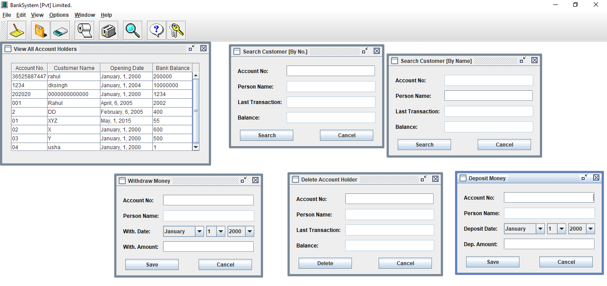
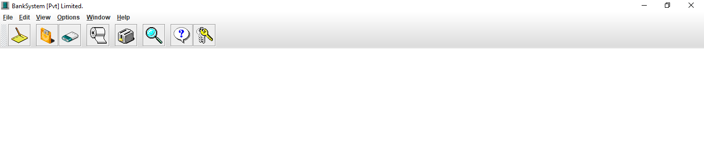
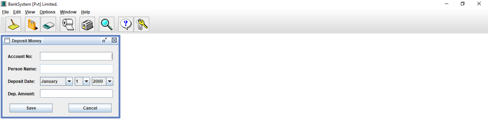

<h1 align="center">🏦 Bank Management System</h1>

<p align="center">
A complete <b>GUI-based banking application</b> built using Java to simulate real-world banking operations.
</p>

<p align="center">


</p>

---

## 📌 Overview

The **Bank Management System** is a desktop-based application designed to manage banking operations efficiently.
It allows users to create accounts, perform transactions, and maintain customer records through an interactive graphical interface.

---

## ✨ Key Features

✔️ Create and manage customer accounts
✔️ Deposit and withdraw money
✔️ Search customers (by name & account number)
✔️ View all account details
✔️ Delete customer records
✔️ User-friendly GUI interface

---

## 🛠️ Tech Stack

| Category | Technology                         |
| -------- | ---------------------------------- |
| Language | Java                               |
| GUI      | Swing / AWT                        |
| Concepts | OOP, Event Handling, File Handling |

---

## 📂 Project Structure

```
BankSystem/
│
├── BankSystem.java
├── NewAccount.java
├── DepositMoney.java
├── WithdrawMoney.java
├── ViewCustomer.java
├── DeleteCustomer.java
│
├── Images/
├── Help/
│
├── assets/
│   └── screenshots/
│       ├── overview.png
│       ├── main.png
│       └── deposit.png
│
└── .gitignore
```

---

## 📸 Application Preview

### 🔹 Complete System Overview

<p align="center">

</p>

### 🔹 Main Screen

<p align="center">

</p>

### 🔹 Deposit Feature

<p align="center">

</p>

---

## ▶️ How to Run

```bash
javac BankSystem.java
java BankSystem
```

---

## 🚀 Future Enhancements

* 🔐 User Authentication System
* 🗄️ Database Integration (MySQL)
* 📊 Transaction History Tracking
* 🎨 Enhanced UI/UX Design

---

## 👩‍💻 Author

**Sristy Pandey**

* 🔗 GitHub: https://github.com/SristyP22
* 💼 LinkedIn: https://www.linkedin.com/in/sristy-pandey-b008922b9
* 🧠 HackerRank (5⭐ Java & Python): https://www.hackerrank.com/profile/pandeysristy910

---

## ⭐ Support

If you found this project helpful, consider giving it a ⭐ on GitHub!
